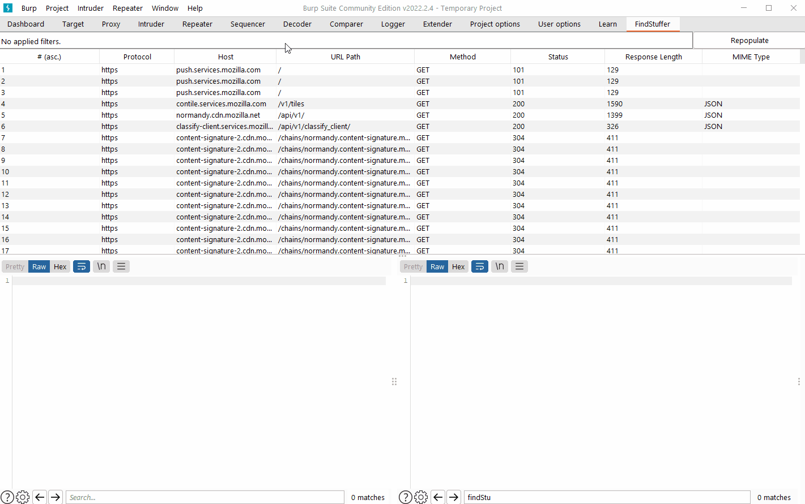

# FindStuffer
FindStuffer, a Burp extension to Find Stuff. It aims to overcome some of the search limitations in Burp's native Proxy HTTP History tab (even in the Pro version.) 

You can use FindStuffer to aggregate as many text queries as needed in one search, and to control the scope of each query.  You can dynamically add as many text queries as needed. Each query can be individually inverted. Each query is applied on the headers and body of its scope.

Check out the tutorial for a more practical and complete example.

## Tutorial / Demo
In this section I will give an example of how to use FindStuffer v0.1.
### Populating with HTTP traffic
First of all, make sure FindStuffer is loaded into your extender

Then, generate some HTTP traffic. In this example, traffic has been generated by visiting Google and Github with Firefox, as can be seen in Burp's native proxy tab:

However, since FindStuffer does not implement any proxy / HTTP listening at the moment, it didn't get any of that traffic. The "Repopulate" button fetches the current HTTP history entries made available through  [Burp's Extender API](https://portswigger.net/burp/extender/api/) and **resets** FindStuffer's history table based on said entries. 

### FindStuffin'
For this demo's purposes, let's say you want to find the items meeting all of the following criteria:
- Request made to the `www.google.com` host 
- (AND) HTTP response containing the `Server` header
- (AND) The `Server` header's value is not `gws`

Note that :
- The search bar's text changes to reflect the executed search.
- The search is executed both on the headers and the body. It is executed on any thing that can be shown in the request & response editors.
- It is possible to add as many fields as possible (theoretically).
- This demo only showed AND-based aggregation. The radio buttons in the bottom of the search modal allow you to choose between AND-based and OR-based query aggregation. 
- Changes made to a text field or a checkbox / radio button in the search modal won't take effect if "OK" isn't used. Simply closing the search modal will make the search modal revert to its previous state (with the exception of keeping the added text fields).
- An empty text field (with no whitespace) is ignored.

## Installation
At this moment, you need to import manually a JAR to your Burp from Extender → Extensions → Add. You can compile this code to create the JAR or you can use the one in this project's releases page. 

## Contributing
If you like the extension and the potential it has to be a practical tool you use often, you are very welcome to contribute to this repo by submitting a pull request. You can also open issues if you encounter bugs or have interesting feature ideas.

### Possible improvements
This section is about features that I recognize as potentially useful and intend to work on some time, without them being a priority. Some of these features can be replaced by clever use of the basic features already implemented. Some do add a lot of value but will need a serious amount of work.

This section should be replaced by Github issues later.
#### Unclumsify UI code
Several Java Swing interfaces were not correctly used in this code, mainly due to the my ignorance when it comes to UI and Java Swing. It is possible that code is very clumsy and that it reimplemented stuff it shouldn't have. But it seemed easier to implement my own sorting / filtering than to learn Swing's seemingly complicated interface, especially in the beginning when I didn't know how to debug the extension in my IDE and didn't have access to any error messages, just failures.

It might be worth it to revisit these parts and make them more "standard" to make contributions easier.
#### Listeners
It would be nice if the extension registers a proxy or HTTP listener to refresh the tables entires automatically as new HTTP traffic is generated. This however must:
- be thread-safe
- take into account existing sorting and filtering
- be memory-efficient
A clever implementation of this could take some serious amount of work.
#### Case-sensitive search
It is not possible to do case-sensitive queries at the moment. Some UI should be made for this.
#### Global negative search
Besides the negative query option available for each individual text field, implement the possibility of inverting the whole search. This is not really essential because the currently implemented filters allow to do equivalent searches (De Morgan's laws). But still, could be nice.
#### Columns
Choose which columns can be displayed / hidden. Modify their order. Also add more types of columns (e.g. mime types).
#### Non-textual queries
This is not the aim of this extension, but might as well make it more practical.
#### Improve UI and UX
This is really not my area and I hate it. But my extension is indeed kinda ugly.

### Dev & debug env setup
TODO : update this with more details if someone actually wants to contribute

You need to add burp's JAR as an external library in your IDE's project, and then you use that main function I left in the BurpExtender class to launch Burp from inside the IDE. After that you'll be able to see the stacktraces, set breakpoints, etc.
